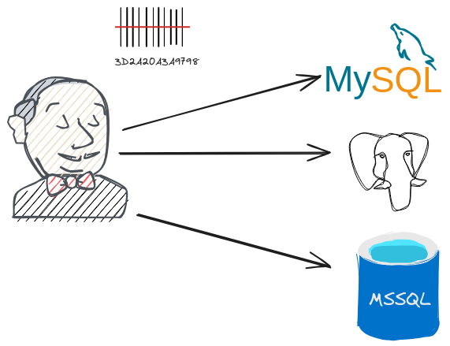
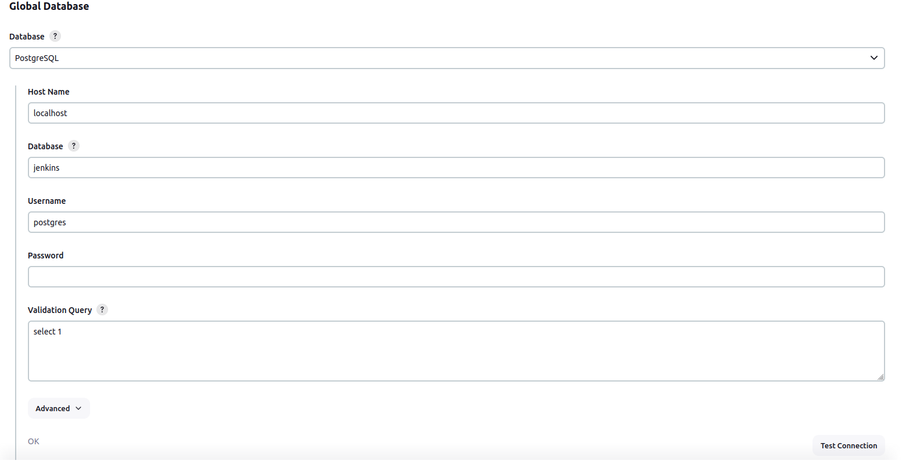

# SQL Fingerprint Storage Plugin

## Introduction

The plugin allows users to configure SQL database for storing fingerprints.

This plugin was forked and extend [postgresql-fingerprint-storage-plugin](https://github.com/jenkinsci/postgresql-fingerprint-storage-plugin) to support MySQL, MariaDB, PostgreSQL, and SQL Server databases.

## Getting started

Once the plugin has been installed, you can configure the Database plugin
server details by following the steps below:

Ensure you have configured a global database

1.  Select `Manage Jenkins`
2.  Select `Configure System`

## Contributing

Review the default [CONTRIBUTING](https://github.com/jenkinsci/.github/blob/master/CONTRIBUTING.md) file and make sure it is appropriate for your plugin, if not then add your own one adapted from the base file

Refer to our [contribution guidelines](https://github.com/jenkinsci/.github/blob/master/CONTRIBUTING.md)

## LICENSE

Licensed under MIT, see [LICENSE](LICENSE.md)

